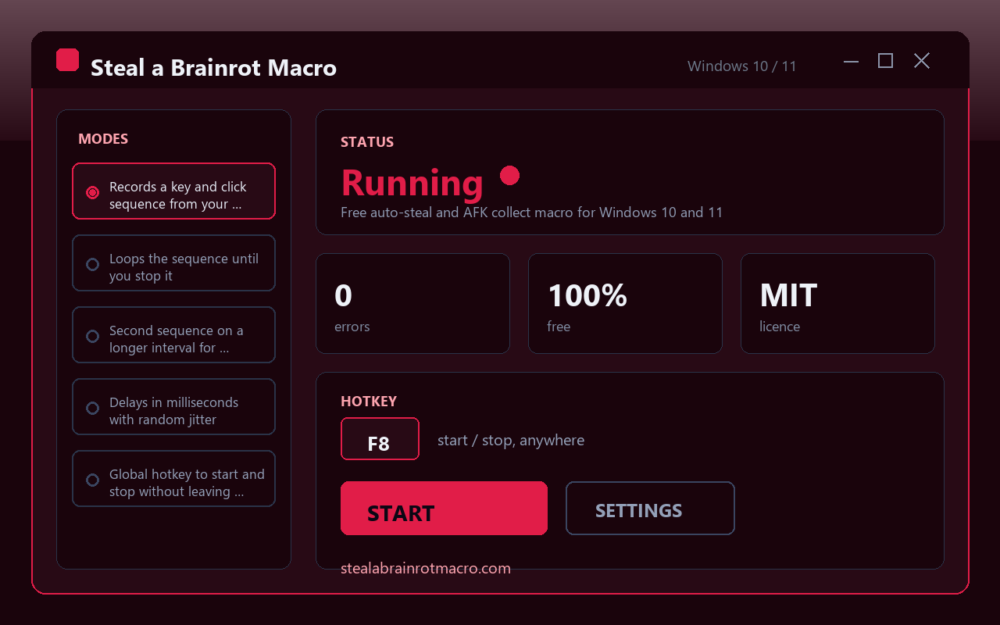

# Steal a Brainrot Macro

Free auto-steal and collect macro for Steal a Brainrot - repeats your recorded key sequence on a loop while AFK. Windows 10/11.

**[⬇ Download for Windows](https://github.com/christianfrei791/steal-a-brainrot-macro/releases/latest)** · [Website](https://stealabrainrotmacro.com)

---

## What it does

Record a sequence once from your own keyboard - the walk, the grab, the way back - and it loops until you stop it. A second sequence can run on a longer interval for collecting or restocking, so a long AFK session does not stall halfway.

## Features

- Records a key and click sequence from your own input
- Loops the sequence until you stop it
- Second sequence on a longer interval for collecting
- Delays in milliseconds with random jitter
- Global hotkey to start and stop without leaving the game
- Named profiles for different routes and servers
- Run counter showing completed loops
- Small installer, no extra components, free and open source (MIT)

## Install

1. Download the latest release: **[Steal a Brainrot Macro](https://github.com/christianfrei791/steal-a-brainrot-macro/releases/latest)**
2. Run the installer. No admin rights, no extra components.
3. Start it from the Start menu.

Windows 10 and Windows 11, 64-bit. Nothing else is required.

## FAQ

**Is it really free?**
Yes. No trial, no locked features, no licence key, no ads.

**Does it change or inject anything into the game?**
No. It only sends the same keystrokes and clicks your own keyboard and mouse send.

**Does it need admin rights?**
No.

**Where is the source?**
Right here. MIT licence, use it however you like.

---

steal a brainrot macro · auto steal macro · roblox afk farm · brainrot macro · roblox macro windows · auto collect macro

Website: https://stealabrainrotmacro.com
