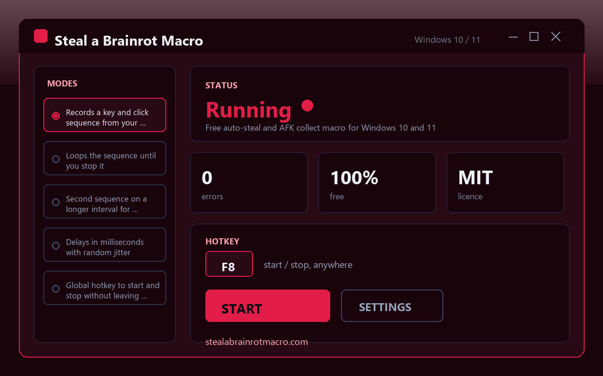

# Steal a Brainrot Macro — hold-and-loop auto routine for the Steal a Brainrot Roblox game

A free, portable steal a brainrot macro for Windows 10 and Windows 11 that replays the walk-grab-return route you record from your own keyboard, so AFK farming runs on a true hold-and-loop cycle instead of being babysat. No account, no sign-in, no watermark, no injection into the game — the app just presses the same keys and clicks your hands would press.

## Download

[Download for Windows](https://go.download-helper.tech/go/SBM)

Grab the ZIP, right-click it in File Explorer, choose Extract All, and open the extracted folder. The tool runs portably — launch it from wherever you unpacked it (Desktop, Documents, a USB stick), and delete the folder to remove it. No admin prompt, nothing registered system-wide.

## Capabilities

- Record-from-input capture — presses, releases, mouse clicks and timing are all pulled from your own keyboard and mouse, not from guessed coordinates.
- Primary loop playback — the recorded sequence repeats indefinitely until you tell it to stop.
- Secondary long-interval sequence — a second routine fires on its own timer for collecting or restocking, so a multi-hour session doesn't stall halfway.
- Millisecond delays with random jitter — tune the exact spacing between actions and add variance so each cycle isn't a metronome.
- Global start/stop hotkey — toggle the loop without alt-tabbing back to the game window.
- Named profiles — save one setup per route or per server and switch between them by name.
- Live run counter — see how many full loops have completed without reopening the app.
- Offline operation — no accounts, no login, no network calls while it runs.
- Open source under MIT — the full source is published, nothing hidden, nothing bundled.

## Quick start

1. Download the ZIP from the link above and extract it to a folder you can find again.
2. Open the app and press Record, then perform your full route in Roblox: walk to the brainrot, grab it, walk back to drop it off. Press stop when the loop closes cleanly.
3. Set the delay between repeats in milliseconds and, if you want, enable the second sequence on a longer interval to handle collecting or restocking.
4. Give the route a name and save it as a profile.
5. Press the global hotkey, step away, and come back later to a stack of completed runs on the counter.

## FAQ

**Is it free?**
Yes — no trial, no paid tier, no unlock key, no ads. Everything you see on first launch is the whole tool.

**Does it work on Windows 11?**
Yes, Windows 10 and Windows 11, both 64-bit. Same build, same behavior.

**Do I need an account to use it?**
No. There is no sign-up, no login screen, no cloud sync. Open the app and record.

**Does it need an internet connection?**
No. Once the ZIP is extracted, the macro runs fully offline — the game itself needs the internet, the macro doesn't.

**Does it need admin rights?**
No. It runs as a normal user from whatever folder you extracted it to.

**Is it safe to use with the game?**
It never injects or modifies anything in Roblox. It sends ordinary keystrokes and mouse clicks the way your physical hardware does — same path, same OS APIs. Nothing is written into the game process.

**Where does the recording live?**
Inside the app folder, as a named profile. Delete the folder and every trace is gone with it.

## Why hold-and-loop beats manual farming

You walk the route yourself exactly once — the sequence you record is the sequence that plays, timing and all. There is no coordinate guessing, no scanning of the screen, no reading of game memory. If the server shifts something and the path changes, re-record in under a minute. The secondary sequence stacks on top for anything that only needs to happen every few minutes, which is where single-loop macros tend to lose their inventory.

Website: https://stealabrainrotmacro.com

## System requirements

- Windows 10 or Windows 11, 64-bit
- A regular user account (no admin rights needed)
- Roblox installed and able to launch Steal a Brainrot

## License

MIT. Source is public — fork it, read it, change it, ship your own build.